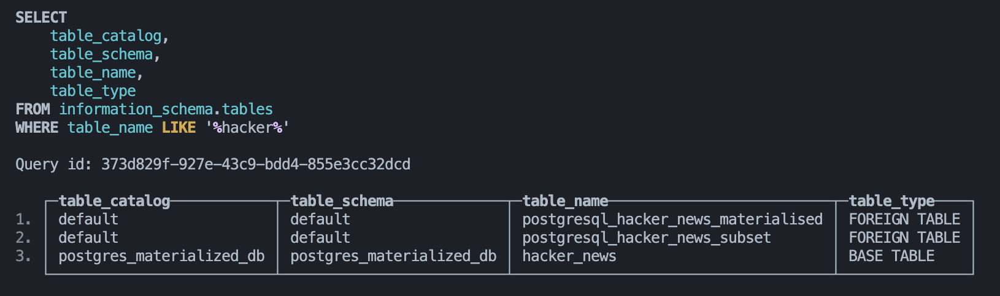

# ClickHouse Database & Deployment Workflow

## Getting Started
If you want to install ClickHouse locally, follow these [installation instructions](https://clickhouse.com/docs/en/getting-started/quick-start)

### ClickHouse Database
Spin up the clickhouse postgres database server in docker
```sh
docker compose up
```

In a new terminal, step into the server and start running with
```sh
docker compose exec clickhouse clickhouse-client
```
or open with a shell
```sh
docker compose exec clickhouse bash
```

## How it Works
`compose.yml` uses a combination of two images: `clickhouse/clickhouse-server` and `postgres`. Both databases have scripts under the `fs/volumes/<database>/docker-entrypoint-initdb.d/` directory. The files in these folders are mapped over and executed in the ClickHouse server docker image's entrypoint. 
* The **postgres** folder contains two sql files:
  * One that creates the hacker_news table and inserts data into it
  * One that enables an index on type and ID and enables replication
* The **clickhouse** folder contains a single sql file that does the following:
  * Sets various permissions allowing ClickHouse to work with the (currently) experimental `MaterializedPostgreSQL` database engine
  * Creates a database `postgres_materialized_db` using the `MaterializedPostgreSQL` database engine which points to the postgres instance at port 5432
  * Creates tables in the default database and schema referencing

When you run `docker compose up`, these files are executed and the data becomes available in clickhouse:
 
